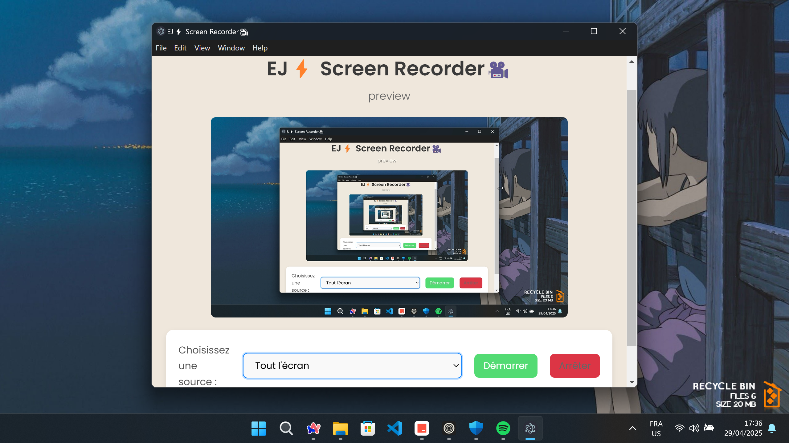

<h1 align="center"># EJ_Recorder 🎥</h1>

<p align="center">
 A simple desktop screen recorder application built with Electron.

This project allows you to select a screen or window and record it, saving the output as a video file.
  
</p>

> This project was made for learning purposes and comes initially from[Fireship]
## Features

*   Screen and Window Recording
*   Video Saving

## Getting Started

### Prerequisites

*   Node.js and npm (or Yarn)

### Installation & Running

1.  Clone the repository (or download the source code).
2.  Navigate to the project directory:
    ```bash
    cd EJ_Recorder
    ```
3.  Install dependencies:
    ```bash
    npm install
    ```
4.  Run the application in development mode:
    ```bash
    npm start
    ```

### Building

To create a distributable package for your operating system:

```bash
npm run make